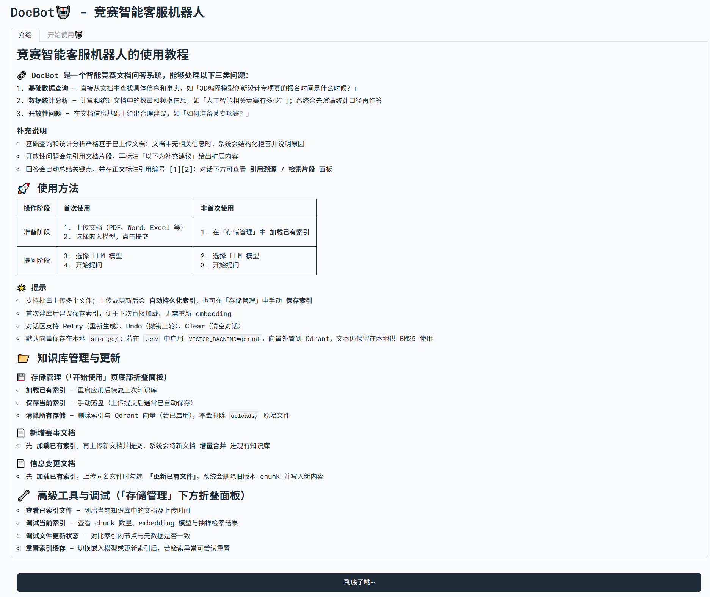
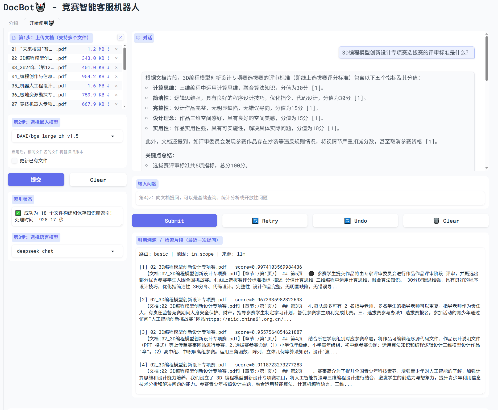
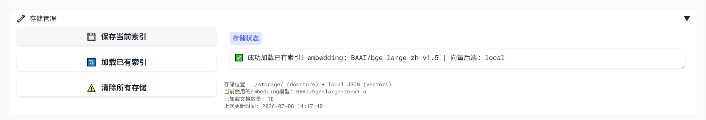
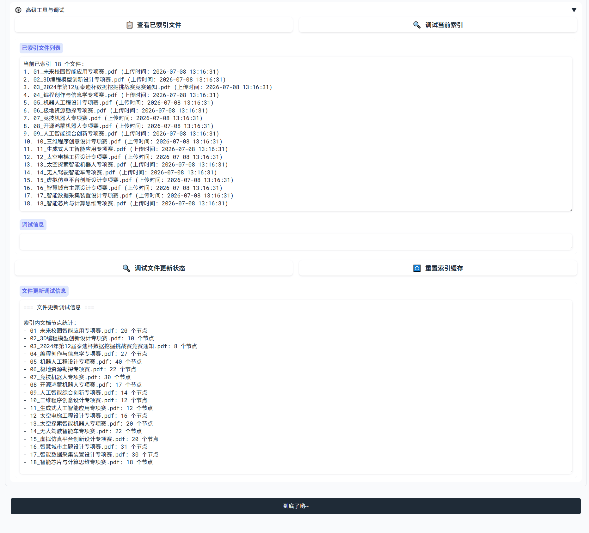
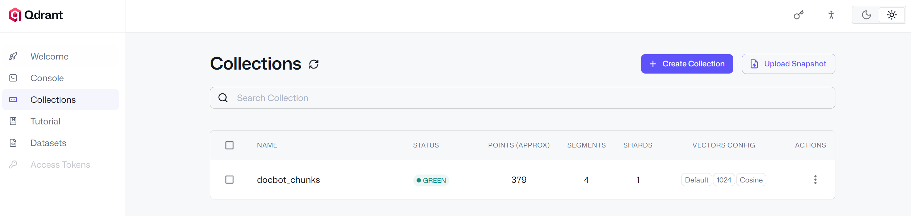

基于 LlamaIndex 的 **Advanced RAG** 系统：Hybrid 检索 + Rerank + LLM 路由 + 引用溯源 + 知识库运维 + RAGAS 评估。详细演进见 [HELP.md](HELP.md)。

## 运行效果

### Gradio 首页 · 使用教程



### 文档上传建库与问答



### 存储管理



### 高级工具与调试



---

本仓库**不包含**大体积模型、向量索引和 API 密钥。克隆后按顺序执行：

### 1. 环境变量

```bash
# Windows PowerShell
copy .env.example .env
# 编辑 .env，填入 DEEPSEEK_API_KEY
```

| 变量 | 必填 | 说明 |
|------|------|------|
| `DEEPSEEK_API_KEY` | 是 | DeepSeek 对话 API |
| `LLAMA_API_KEY` | 否 | Office 解析 + PDF 质检失败时的 fallback（LlamaParse，已列入 `requirements.txt`）；**PDF 默认走 pdfplumber** |
| `VECTOR_BACKEND` | 否 | `local`（默认）或 `qdrant`；见下方「向量外置」 |
| `QDRANT_URL` | 否 | Qdrant 地址，默认 `http://localhost:6333` |

### 2. 安装依赖

```bash
# 建议 Python 3.10+
python -m venv venv
.\venv\Scripts\activate          # Windows
# source venv/bin/activate       # Linux / macOS

pip install -r requirements.txt
```

### 3. 下载模型（本地，不入 Git）

Embedding 与 Rerank 模型体积约 **数 GB**，保存在 `./models/`，已在 `.gitignore` 中排除。

```bash
# Rerank 模型（推荐先执行，含 ModelScope 国内镜像）
python download_rerank_model.py

# Embedding 示例（bge-large-zh-v1.5）
python load_embedding_models.py
```

首次启动时，`warmup_models()` 也会通过 **ModelScope（魔塔）** 加载缺失模型（`USE_MODELSCOPE=True`，见 `app/config.py`）。无需访问 huggingface.co。

**期望目录结构（下载完成后）：**

```
models/
├── bge-large-zh-v1.5/      # 中文 Embedding
├── bge-small-en-v1.5/      # 英文 Embedding（可选）
└── bge-reranker-v2-m3/     # Rerank
```

### 4. 准备文档

`data/` 目录默认不入库（竞赛 PDF 体积大）。请自行准备 PDF/Office 文档，通过 Gradio 上传或 API `POST /api/v1/index/upload` 建库。

---

## 快速启动

```bash
.\venv\Scripts\activate
pip install -r requirements.txt

# Gradio UI（:7860）
python main.py
# 浏览器打开 http://127.0.0.1:7860
```

入口：`main.py`（Gradio UI）或 `api_server.py`（FastAPI）。

## FastAPI

```bash
.\venv\Scripts\activate
pip install -r requirements.txt
python api_server.py
# API 文档: http://127.0.0.1:8000/docs
# 默认端口 8000，可与 Gradio :7860 同时运行（各自独立进程）
```

### 常用接口

| 方法 | 路径 | 说明 |
|------|------|------|
| `GET` | `/health` | 健康检查 |
| `GET` | `/api/v1/status` | 索引与模型状态 |
| `POST` | `/api/v1/chat` | 问答（含 citations、route、retrieval_debug） |
| `POST` | `/api/v1/index/load` | 加载 storage 索引 |
| `POST` | `/api/v1/index/upload` | 上传 PDF 并建索引（multipart） |

```bash
curl http://127.0.0.1:8000/api/v1/status

curl -X POST http://127.0.0.1:8000/api/v1/chat \
  -H "Content-Type: application/json" \
  -d "{\"question\": \"3D编程模型创新设计专项赛报名时间是什么时候？\"}"
```

Gradio 与 API **共用** `app/services/qa_service.py`，RAG 行为一致。

## Docker

```bash
# 准备 .env（含 DEEPSEEK_API_KEY）
cp .env.example .env

# 启动 API（需本地 models/ 已有模型，通过 volume 挂载）
docker compose up -d --build

# 可选 Gradio UI
docker compose --profile ui up -d --build
```

| 服务 | 地址 | 说明 |
|------|------|------|
| API | http://127.0.0.1:8000/docs | 默认启动 |
| Gradio | http://127.0.0.1:7860 | `--profile ui` |

挂载目录：`models/`、`storage/`、`uploads/`。详见 [HELP.md](HELP.md)。

## RAGAS 评估

对 `eval/questions.json` 中 5 题，基于 `week1_results.json` / `week2_results.json` 的历史回答跑 RAGAS：

```bash
python eval/run_ragas.py
```

输出目录：`eval/week3_ragas/`（含 JSON 指标与 `comparison.md`）。

### Week 1 vs Week 2 量化对比（2026-07-06）

| 指标 | Week 1 | Week 2 | 变化 |
|------|--------|--------|------|
| faithfulness | 0.732 | 0.865 | +0.133 |
| answer_relevancy | 0.492 | 0.527 | +0.035 |
| context_precision | 0.467 | 0.467 | — |

| ID | 问题 | 人工 Week 1 | 人工 Week 2 |
|----|------|-------------|-------------|
| Q001 | 在哪举办 | 部分通过 | 部分通过 |
| Q002 | 一共几个比赛 | 部分通过 | 部分通过 |
| Q003 | 未来校园流程 | 通过 | 通过 |
| Q004 | 3D 报名时间 | 通过 | 通过 |
| Q005 | 两赛参赛资格 | 通过 | 部分通过 |

完整逐题 RAGAS 分数见 [eval/week3_ragas/comparison.md](eval/week3_ragas/comparison.md)。

---

## 项目结构

| 路径 | 入库 | 说明 |
|------|------|------|
| [app/](app) | ✅ | 核心业务代码（ingestion / retrieval / routing / generation / api / ui） |
| [eval/](eval) | ✅ | 评测集、RAGAS 脚本与报告 |
| [scripts/](scripts) | ✅ | Docker entrypoint 等 |
| [api_server.py](api_server.py) | ✅ | FastAPI 入口（:8000） |
| [main.py](main.py) | ✅ | Gradio 入口（:7860） |
| [models/](models) | ❌ | 本地 Embedding / Rerank（克隆后下载） |
| [storage/](storage) | ❌ | 向量索引持久化（运行后生成） |
| [uploads/](uploads) | ❌ | 用户上传的原始文件 |
| [data/](data) | ❌ | 竞赛 PDF（默认忽略，请自备） |
| [.env](.env) | ❌ | API 密钥（使用 [.env.example](.env.example) 模板） |
| [.env.example](.env.example) | ✅ | API 密钥模板 |
| [LICENSE](LICENSE) | ✅ | MIT 开源许可证 |
| [venv/](venv) | ❌ | 虚拟环境 |

其他：`[first_problem/](first_problem)` C 题第一问代码（`python -m first_problem.competition_info`）；`[load_embedding_models.py](load_embedding_models.py)` / `[download_rerank_model.py](download_rerank_model.py)` 模型下载脚本；`[Dockerfile](Dockerfile)` / `[docker-compose.yml](docker-compose.yml)` 可选容器部署。

### 可选：Qdrant 向量外置

默认 `VECTOR_BACKEND=local`，无需额外服务。文档量大时可切换：

```bash
docker compose --profile qdrant up -d
# .env: VECTOR_BACKEND=qdrant
python scripts/migrate_to_qdrant.py   # 从本地索引迁移到Qdrant
```
#### Qdrant 向量外置实现效果



详见 [HELP.md](HELP.md)「Qdrant 向量外置」章节。

---
